# Yelp-Challenge 

## PyRestaurants -  What yelp star rating and review count tell us about restaurants ?

## Background

This respository performed analysis on Yelp's dataset, and share observable trends and insights. The dataset used a subset of Yelp's restaurants businesses, their rating, review count, and other informations. In the dataset you'll find information about restaurants across 4 main cities (New-York, Los Angeles, Chicago, and Toronto), and 192 cities in metropolitan areas in United States and Canada. A Google Map Api is also used to heat map all resturants in the dataset, and mark the top rated, and reviwed restaurants.

Yelp is a user-driven small business directory which allows users from anywhere in the world to rate, review, and it is also an online reservation service. Due to the vast number of restaurants spread worldwide, it is very difficult to get to know the quality of a restaurant and the services they provide. Yelp provides us with reviews and ratings provided by the users and other services offered by the restaurants. In-order-to invest in a business or start a new one, one should have an idea of the reasons behind the success of the restaurant. The original yelp data set has the general details of restaurants but there is no analytics to infer customer satisfaction and the reasons behind the success of a restaurant. If the factors contributing to the success of a restaurant are known, it would be easy for future investors to make wise financial decisions easily. It would also be easy for foodies like us to know which new restaurants to give a try. On this project we focus on investigating the relationship between review counts, price, location of restaurants and ratings given by customers to help explain the restaurants yelp status.

The project is conducted in Jupyter notebook, a link is created on Jupyter Notebook Viewer, and a google slide pesentaion to showcase, and communicate the analysis report. Look the following links to see the project results: 

[Jupyter Notebook Viewer](https://docs.google.com/presentation/d/e/2PACX-1vRpu8dnqpNiuyY7g5pVgwBHW-YRedfeQBfZ_jYmPrz-UWYT4iIY5TJieKgJKwOyoMK00bH-hFyZFuBx/embed?start=true&loop=false&delayms=3000)

[Slide Deck](https://docs.google.com/presentation/d/18kY4XLbcT_GdVwHyEcaL3RdbgxqKEP4Yf2N2Kd7t5x4/edit#slide=id.g8a46eab42c_3_30)

## Table of Contents
* [Main Objectives or Questions](#Main_Objectives_or_Questions_to_Answer)
* [Data Sources](#Data_Sources)
* [Data Cleaning](#Data_Cleaning)
* [Data Analysis](#Data_Analysis)
   - [Restaurants Data Summary](#Restaurants_Data_Summary)
   - [City Summery](#City_Summary)
   - [Correlation and Regression](#Correlation_and_Regression)
   - [Google Heat Map and Visualization](#Google_Heat_Map_and_Visualization)
* [Observable Trends and Insights](#Observable_Trends_and_Insights)

##  Main Objectives or Questions to Answer
 This project tried to answer the following main questions: 
*  Is there a relationship or correlation between rating and number of reviews?
*  Is pricing related to the restaurant rating? (eg. the higher the price range, the more likely it will have a higher rating)
*  Does the location of a restaurant affect its rating?
*  What are the average, above-average and below-average restaurants?

## Data Sources
This project used Yelp, and Google Map Api to generate, and work on restaurant dataset among the top four largest cities in North America (New-York, Los Angeles, Chicago, and Toronto), and their surrounding areas. The data is generated by using Yelp API calls and transformed to csv file so that we can apply Python to analyze, and visualize the dataset. To see the process how to use yelp API, and request the dataset please visit the following subfolder link [Yelp-Api](https://github.com/ermiasgelaye/Yelp-Challenge/tree/master/Yelp-api)
            
  - Information on 19995 restaurants
  - The data spans 4 main cities (New-York, Los Angeles, Chicago, and Toronto) and 185 cities in metropolitan areas in united states and Canada.
  - Google map visualization 

## Data Cleaning
The data cleaning process includes renaming the column heading, remove the duplicate rows, and drop irrelevant data columns. The data points before cleaning were 19995, and after cleaning, 15731 data points get ready for analysis. 

## Data Analysis
The data analysis has two part the first part is making summery analysis on the metrics of the dataset, and the second part is the main analysis which includes Correlation and Regression.
## Summary Statistics
###  Restaurants Data Summary
<table border="1" class="dataframe">
  <thead>
    <tr style="text-align: right;">
      <th></th>
      <th>Total Restaurant Number</th>
      <th>Total Number of Cities</th>
      <th>Avarage Rating</th>
      <th>The Average Review Count</th>
      <th>% Restaurants Top Rating</th>
      <th>% Restaurants Bottom Rating</th>
      <th>% Restaurants Top Review Count</th>
      <th>% Restaurants Bottom Review Count</th>
      <th>% Best Restaurants</th>
      <th>% Worst restaurants</th>
    </tr>
  </thead>
  <tbody>
    <tr>
      <th>0</th>
      <td>15731</td>
      <td>189</td>
      <td>3.61</td>
      <td>260.26</td>
      <td>51.88%</td>
      <td>6.93%</td>
      <td>25.97%</td>
      <td>52.37%</td>
      <td>4.84%</td>
      <td>2.42%</td>
    </tr>
  </tbody>
</table>

### Restaurants Star Rating
The most common restaurant review rating given at most places is 4 stars out of 5. The Average rating is 3.61.
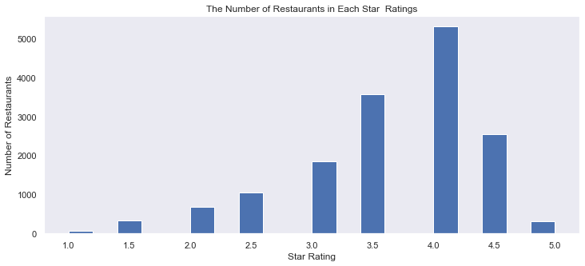

### Top 20 Restaurants by Review count
The top review count result, Katz’s Delicatessen has a 4.5 star rating with 21,803 reviews. Meanwhile the lowest of the top 20, Hae Jang Chon Korean BBQ Restaurant also has a 4.5 star rating with 2,427 reviews.

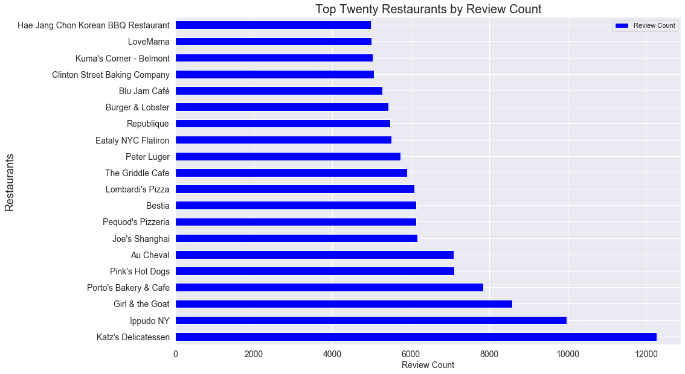

### Restaurants Pricing Summary
Price Range ($)
- $ = Under $10
- $$ = Between $11-$30
- $$$ = Between $31-$60
- $$$$ = Above $60

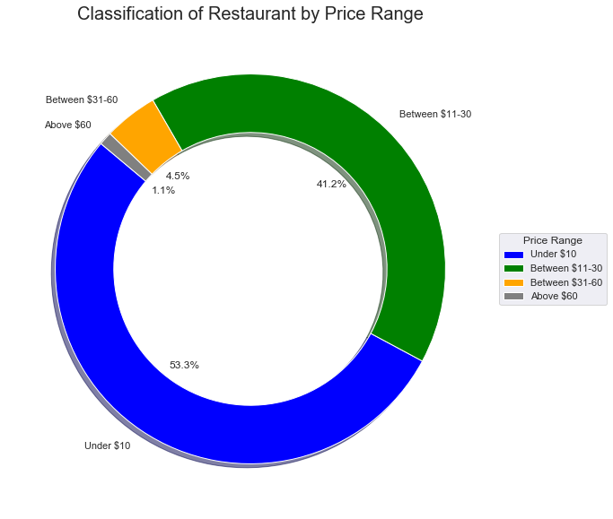

### City Summary
The top restaurants from our data appear mostly in Los Angeles, Chicago, Toronto and New York.The three states are California, Illinois and New York. The only province is Ontario.
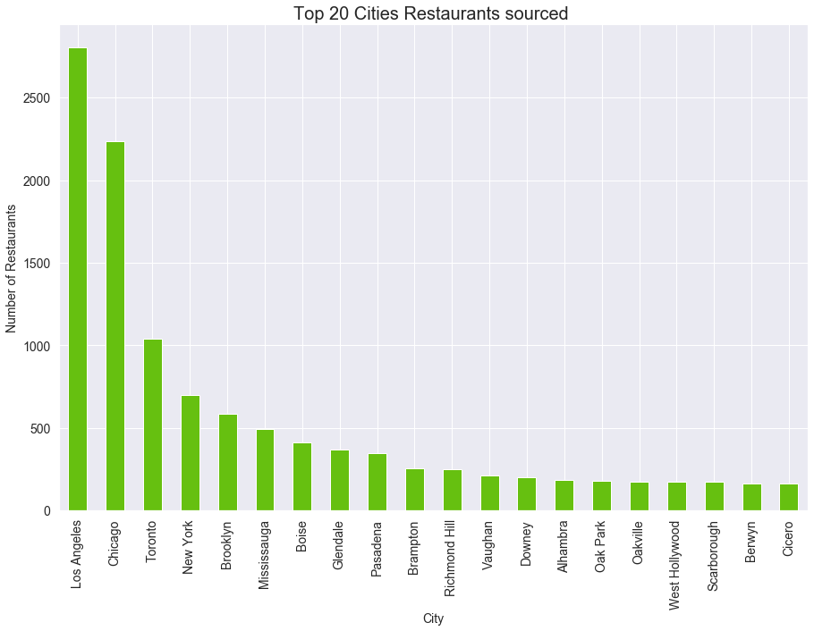

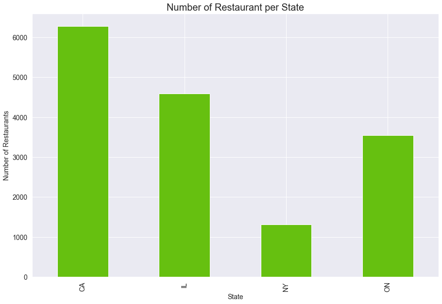

The top cities with highest average rating and review count. 

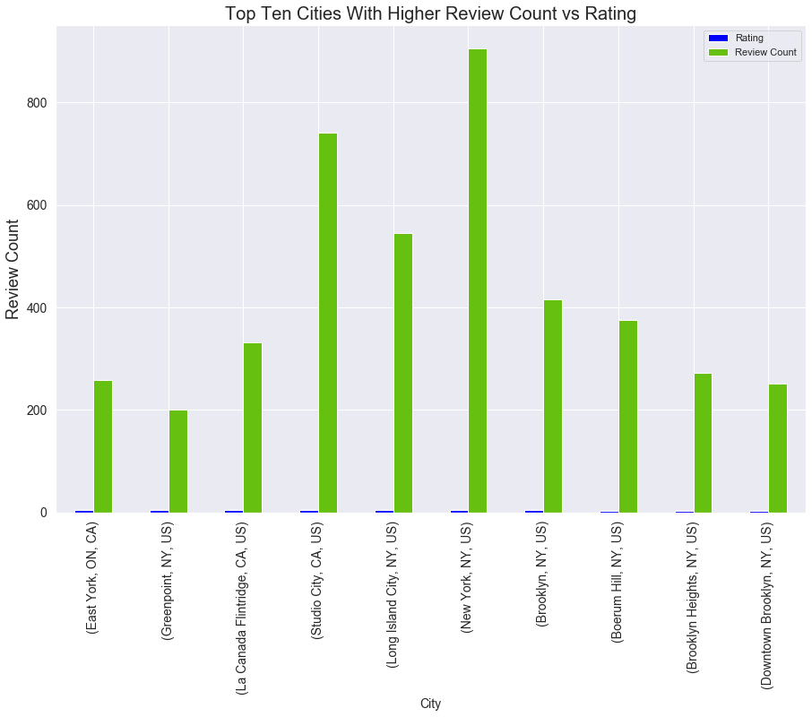

## Correlation and Regression

### Star Rating Versus Review Count
The result on the restaurant's star rating versus review count showed a very weak positive correlation (0.11), and very low R-squared value(0.012).Therefore it’s indicated that while both variables go up in response to one another, the relationship is not very strong, and the regression model does not  fit significantly to predict the data.
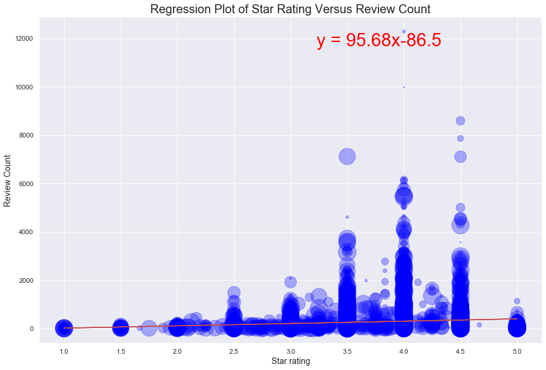

### Scatter Plot - Star Rating Versus Price
A scatter plot that displays  the relationship between star rating versus price, the color differentiation  shows the difference in price range. 
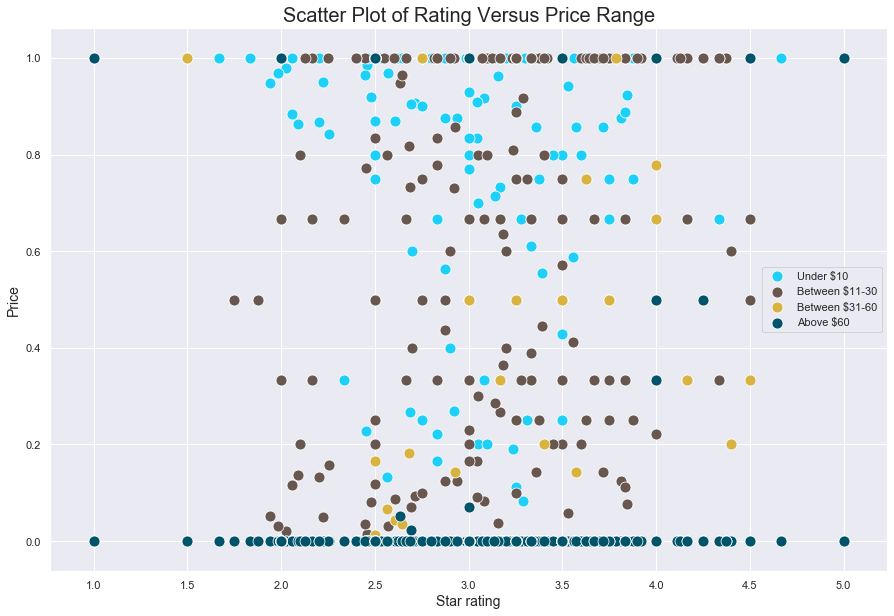

### Correlation Matrix of Star Rating, Review Count, Price

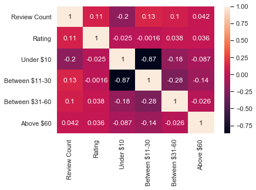

### Star Rating Versus Price
The correlation between price versus star rating is weak and has a very low R-squared value for all price ranges. However, what we understand from the data is that the direction of the relationship changes when the price goes up. When the price is under $30 the relationship was negative, while price become over $30 the relationship changed to positive. 
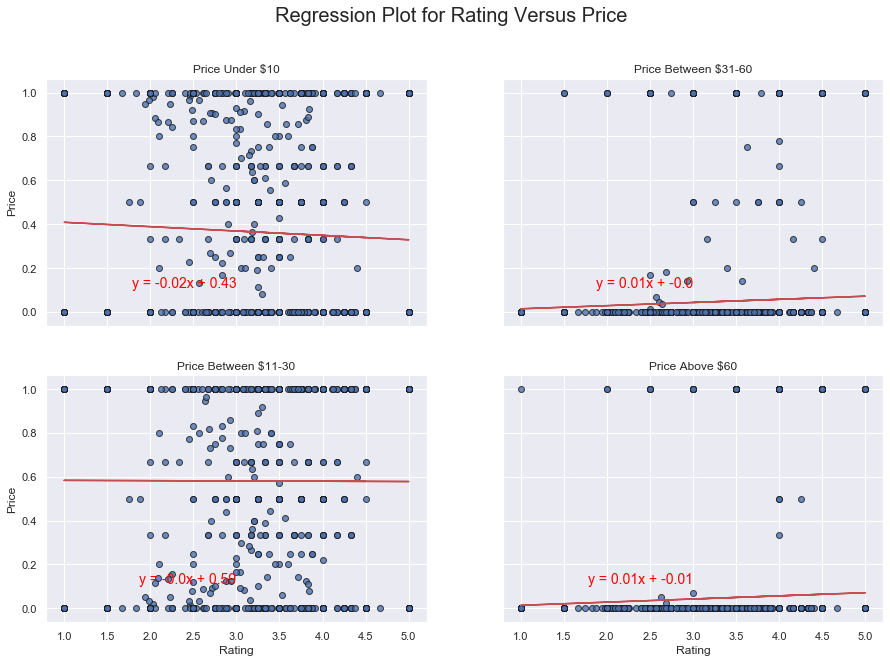

### Review Count Versus Price
The correlation between price versus Review Count is a very weak positive correlation and the data showed a low R-squared value for all price ranges. This may be due to the outlier data points in review counts. 
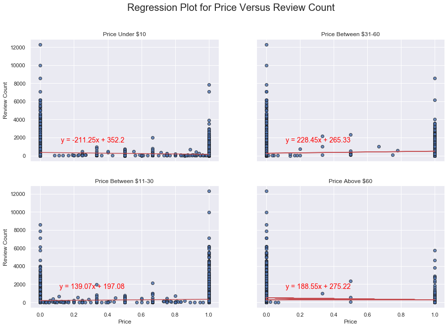

## Google Heat Map and Visualization
### Heat map of all restaurant locations used in research.

### Restaurants With the Highest Review Count
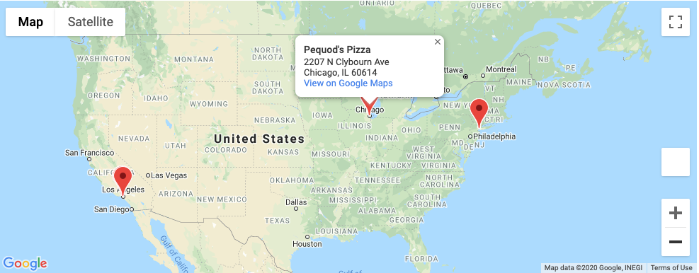

### Restaurants with the Highest Rating(s) and Review Count
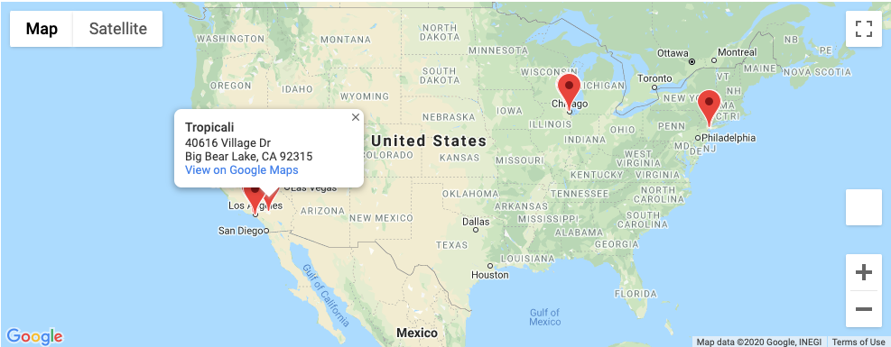

## Observable Trends and Insights
- The average star rating of restaurants is 3.61, which is a good indication of restaurants in the selected locations has a good service.
- Other things remains constant from this research findings it is understood that there is a very weak positive correlation between star ratings , and review  couts. It is also difficult to model, and predict the data on this relationships at the moment. 
- The other interesting finding of this project is the relationship between price and star rating. However, there is a very weak correlation, and regression value to predict rating on restaurants price range, but the direction of the relationship start changing when the price go up.  When price is under $30 the relationship was negative, while price is going up from $30 the relationship become positive. 
- It is too crude to assume all the restaurant data points as one sample, because some data systematically variate from other data. The fundamental structure of the dataset should be grasped first before further, finer analysis.
- The top restaurant in terms of review count is Katz’s Delicatesse with 21,803 reviews, located in Manhattan, New York City, and the lowest one is Tacos El Bombon with 1 review count, and it is located in Los Angeles, California. 
 - The top restaurant in terms of both  review count, and star rating is Tropicali with 1126.0 review count and 5 star rating.
New York get the highest average reviews count(905) and East York, ON get the highest average rating (4.5) and review count(259)
- One of the limitation of this study is the review cout data has outliers. Our outlier testing also showed that there is upper hand outliners. The median is 91 the upper outlier is 12280. We are tempted to remove the outliers ,outliers increase the variability of the data, which decreases statistical power. 
In the next research  if we take appropriate sample and remove the outliers we can get a better result to conclude.   

## Team members (Team Eagle):
 - Adedamola Atekoja (‘Damola)
 - Amanda Qianyue Ma
 - Amos Johnson  
 - Ermias Gaga 

